# GitHub Repository Intelligence

**Understand what a repository is really doing.**

GitHub Repository Intelligence turns any public GitHub repository into an
engineering intelligence dashboard — health scoring, activity and
collaboration analytics, AI-generated insights, side-by-side repository
comparison, exportable reports, and a browser extension that surfaces
health scores directly on GitHub.

**Live app:** https://github-intelligence-nine.vercel.app
**API:** https://github-intelligence.onrender.com
**Browser extension:** [Latest release](https://github.com/AboobakerSiddique/Github-Intelligence/releases/tag/extension-v1.0.0)

---

## Table of Contents

- [Overview](#overview)
- [Screenshots](#screenshots)
- [Features](#features)
- [Tech Stack](#tech-stack)
- [Architecture](#architecture)
- [Project Structure](#project-structure)
- [Getting Started](#getting-started)
- [Environment Variables](#environment-variables)
- [API Reference](#api-reference)
- [Browser Extension](#browser-extension)
- [Deployment](#deployment)
- [Roadmap](#roadmap)
- [Contributing](#contributing)
- [License](#license)

---

## Overview

Point GitHub Repository Intelligence at any `owner/repo` on GitHub and it
pulls activity, contributor, issue, pull request, and release data from the
GitHub REST API, then turns it into:

- a **health score** summarizing the overall state of the project
- **engineering and collaboration metrics** (commit cadence, issue/PR
  turnaround, contributor spread, release frequency)
- **AI-generated narrative insights** explaining what the numbers mean
- a **comparison view** for evaluating two repositories side by side
- a **shareable Markdown or PDF report** for offline use or sharing
- a **browser extension** that shows the health score right on the repo page

It's built for developers evaluating dependencies, maintainers tracking
project health, and anyone who wants a fast, structured read on a codebase
without digging through the GitHub UI by hand.

## Screenshots

| View | Preview |
|---|---|
| Home | 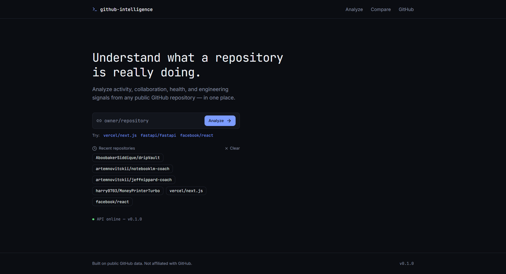 |
| Repository Analysis | 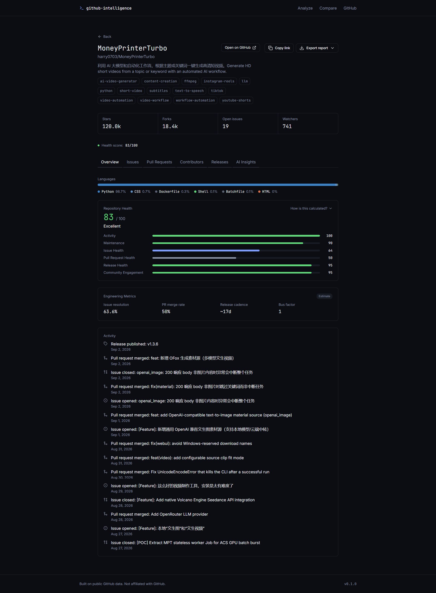 |
| Health Score Breakdown | 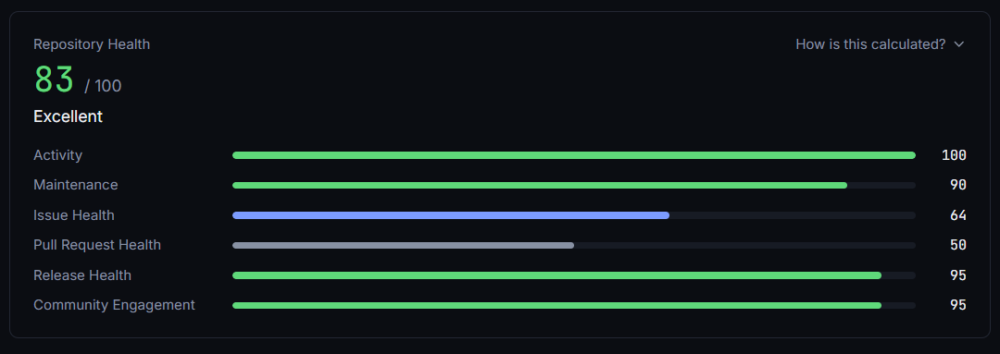 |
| Issues page | 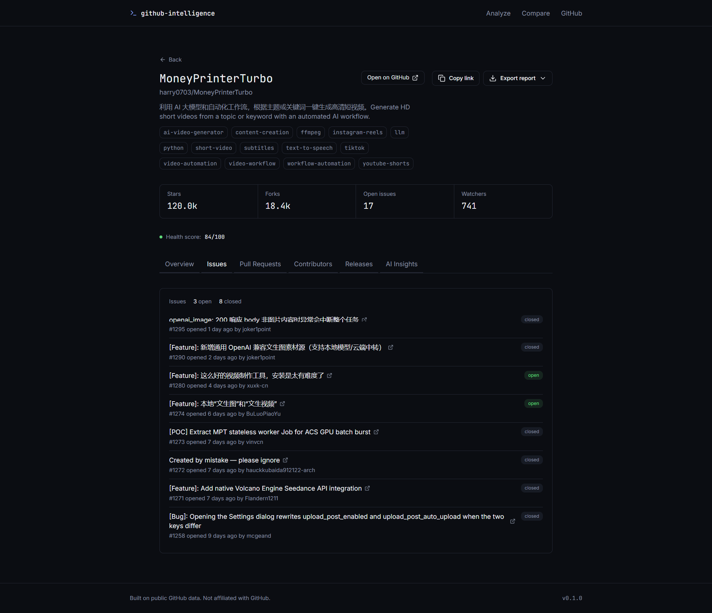 |
| Pull Request Page | 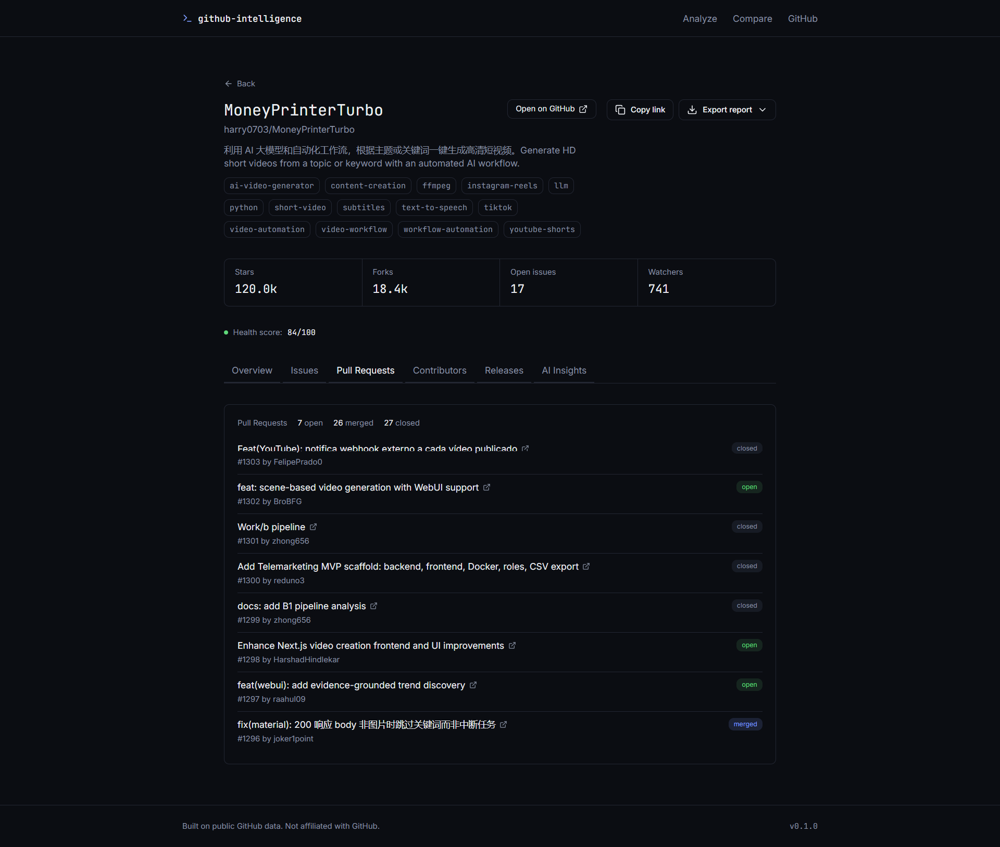 |
| Contributors page |  |
| Releases page | 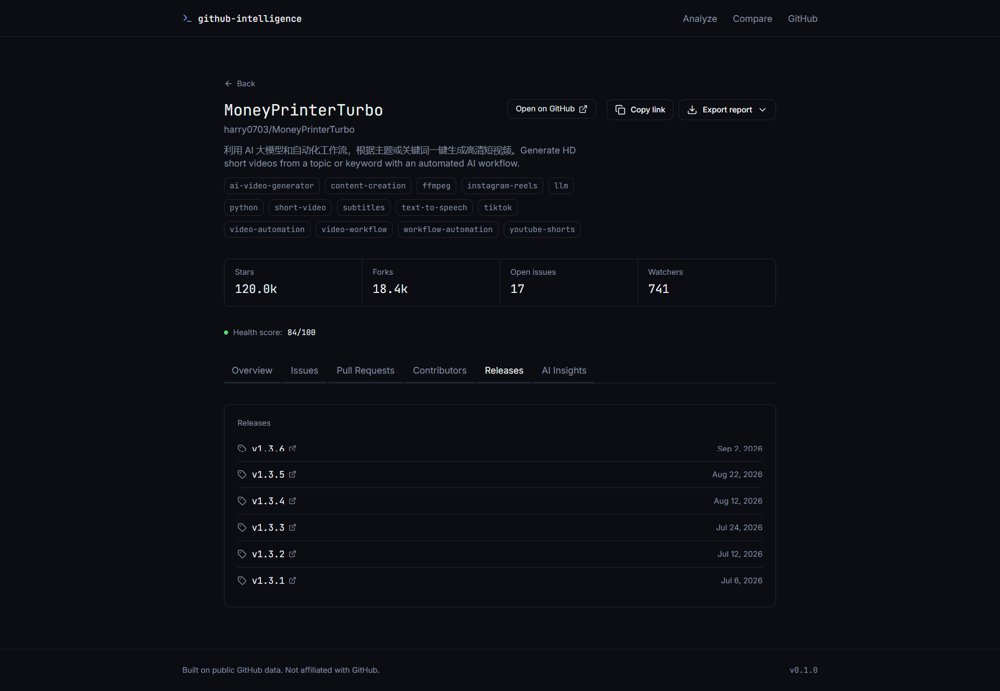 |
| AI insight page | 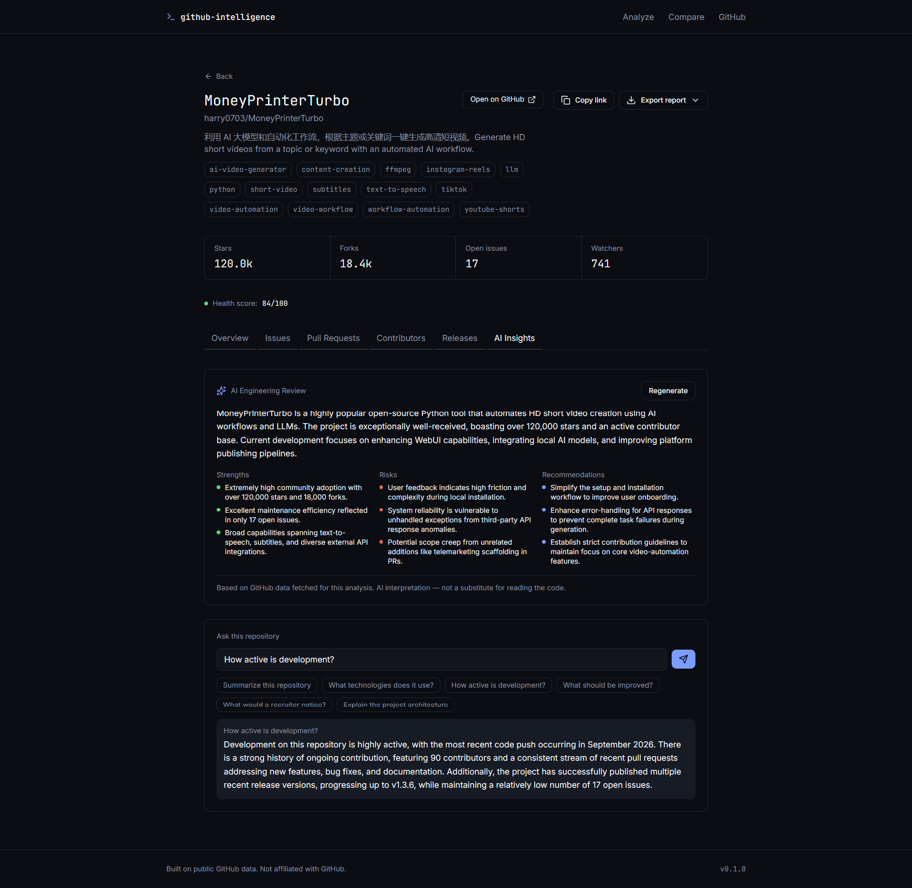 |
| Compare Mode | 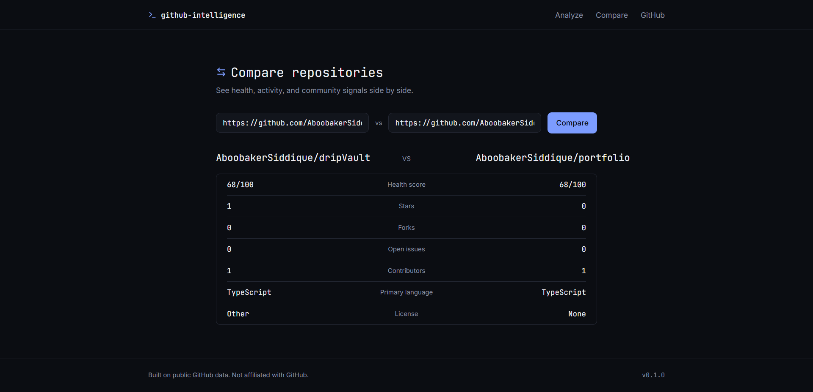 |
| Export (Markdown/PDF) | 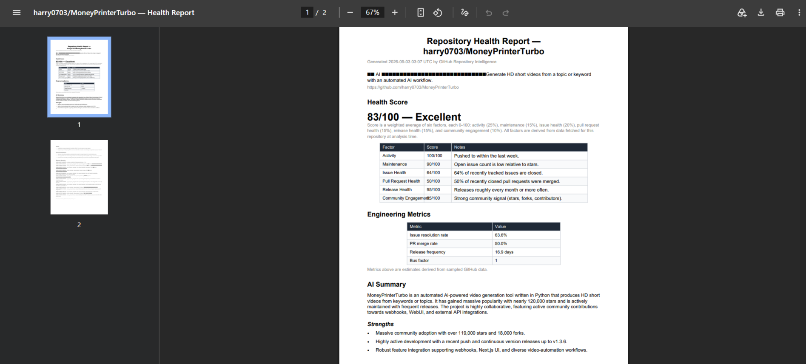 |

**Browser extension in action:**

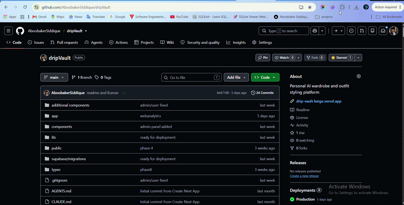

## Features

- 🔍 **Repository Analysis** — activity, contributors, languages, releases
  for any public repo
- 📊 **Health Score** — a single composite score with contributing factors
  broken out
- 🤖 **AI Insights** — narrative summaries generated via Google Gemini
- ⚖️ **Compare Mode** — put two repositories side by side on the same
  metrics
- 📄 **Export Reports** — download the full analysis as a Markdown or PDF
  report, generated server-side from the same data shown on the dashboard
- 🧩 **Browser Extension** — injects a color-coded health score badge
  directly onto GitHub repo pages, linking back to the full dashboard
- ⚡ **Response Caching** — GitHub API responses cached server-side to stay
  well under rate limits
- 🔐 **Optional GitHub Token** — raises the GitHub API rate limit from
  60/hr to 5,000/hr

## Tech Stack

**Frontend**
- [Next.js 16](https://nextjs.org/) (App Router, Turbopack)
- [React 19](https://react.dev/)
- TypeScript
- Tailwind CSS 4
- [Recharts](https://recharts.org/) for data visualization
- [Radix UI](https://www.radix-ui.com/) primitives + `class-variance-authority`
- [Lucide](https://lucide.dev/) icons

**Backend**
- [FastAPI](https://fastapi.tiangolo.com/) (Python 3)
- [Pydantic v2](https://docs.pydantic.dev/) for schema validation and settings
- [httpx](https://www.python-httpx.org/) for async HTTP calls to GitHub and Gemini
- [uvicorn](https://www.uvicorn.org/) ASGI server
- [ReportLab](https://www.reportlab.com/) for server-side PDF report generation
- [pytest](https://docs.pytest.org/) + `pytest-asyncio` + `respx` for testing

**Browser Extension**
- Manifest V3, vanilla JS content script + background service worker (no
  build step, no frameworks)

**External services**
- GitHub REST API — repository, contributor, issue, PR, and release data
- Google Gemini API — AI-generated insight narratives

**Hosting**
- Frontend: [Vercel](https://vercel.com/)
- Backend: [Render](https://render.com/)

## Architecture

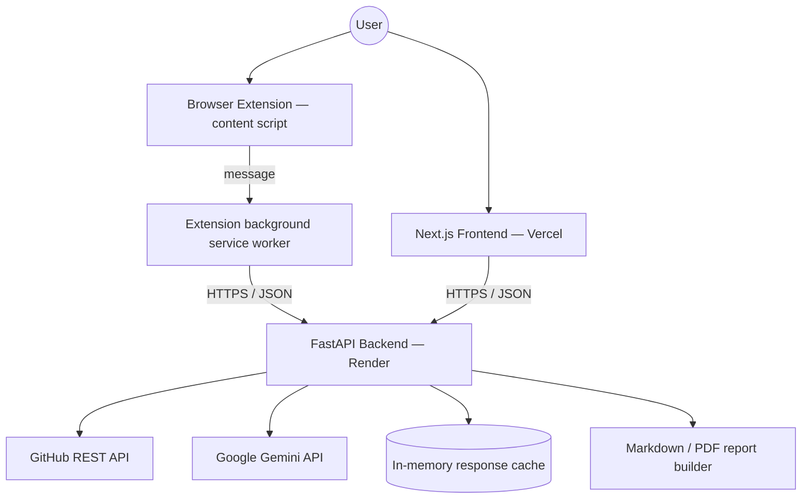

The frontend and extension never talk to GitHub or Gemini directly — every
external call is proxied and cached through the FastAPI backend, so API
keys and tokens stay server-side and are never exposed to the browser.

The extension's content script (which runs in the context of github.com)
delegates its data fetch to the extension's own background service worker
rather than calling the API directly. This avoids the page's own CORS
restrictions, since the background worker is authorized via the
`host_permissions` declared in the extension's manifest.

## Project Structure

```
github-intelligence/
├── backend/
│   ├── app/
│   │   ├── api/            # Route handlers (health, repositories, analytics, ai, compare, export)
│   │   ├── clients/        # External API clients (GitHub, Gemini)
│   │   ├── services/       # Business logic (analytics, AI narrative generation, export/PDF)
│   │   ├── schemas/        # Pydantic request/response models
│   │   ├── utils/          # Logging and shared helpers
│   │   ├── config.py       # Settings (env-driven)
│   │   └── main.py         # App entrypoint, middleware, router wiring
│   ├── tests/
│   ├── requirements.txt
│   └── Dockerfile
├── frontend/
│   ├── app/
│   │   ├── page.tsx                     # Home / search
│   │   ├── analyze/[owner]/[repo]/      # Repository analysis view
│   │   └── compare/                     # Comparison view
│   ├── components/
│   ├── lib/                             # API client + export helpers
│   ├── hooks/
│   └── package.json
├── extension/
│   ├── manifest.json        # Manifest V3 config
│   ├── background.js        # Service worker — proxies analytics fetch (avoids page CORS)
│   ├── content.js           # Detects repo pages, injects health badge
│   ├── content.css          # Badge styling
│   ├── icons/
│   └── PRIVACY.md           # What data the extension sends and why
└── docs/
    ├── screenshots/          # App screenshots used in this README
    └── gifs/                 # Extension demo GIF(s) used in this README
```

## Getting Started

### Prerequisites

- Node.js 20+
- Python 3.12+
- A [GitHub personal access token](https://github.com/settings/tokens) (optional but recommended)
- A [Google Gemini API key](https://aistudio.google.com/apikey)

### Backend

```bash
cd backend
python -m venv venv
source venv/bin/activate      # Windows: venv\Scripts\activate
pip install -r requirements.txt
cp .env.example .env          # then fill in the values, see below
uvicorn app.main:app --reload
```

The API will be available at `http://localhost:8000`. Interactive docs at
`http://localhost:8000/docs`.

### Frontend

```bash
cd frontend
npm install
cp .env.example .env          # then fill in the values, see below
npm run dev
```

The app will be available at `http://localhost:3000`.

### Running Tests

```bash
cd backend
pytest
```

## Environment Variables

### Backend (`backend/.env`)

| Variable             | Required | Description                                                        |
|-----------------------|----------|----------------------------------------------------------------------|
| `ENVIRONMENT`          | No       | `development` or `production`                                     |
| `LOG_LEVEL`            | No       | Logging verbosity (default `INFO`)                                |
| `GITHUB_TOKEN`         | No       | Fine-grained PAT, no special scopes needed for public repo reads. Raises rate limit to 5,000/hr |
| `GEMINI_API_KEY`       | Yes      | Google Gemini API key, used for AI insight generation              |
| `FRONTEND_URL`         | Yes      | Exact origin of the deployed frontend, used for CORS. No trailing slash |
| `CACHE_TTL_SECONDS`    | No       | How long GitHub API responses are cached (default `300`)          |

### Frontend (`frontend/.env`)

| Variable                | Required | Description                                          |
|--------------------------|----------|--------------------------------------------------------|
| `NEXT_PUBLIC_API_URL`    | Yes      | Base URL of the deployed FastAPI backend. No trailing slash |

> **Note:** `FRONTEND_URL` and `NEXT_PUBLIC_API_URL` must point at each
> other's *exact* deployed origins (protocol + domain, no trailing slash) —
> a mismatch here is the most common cause of "API offline" in the UI, since
> the browser will silently block cross-origin requests that fail CORS.

## API Reference

Base URL: `https://github-intelligence.onrender.com`

| Method | Endpoint                                            | Description                          |
|--------|-------------------------------------------------------|---------------------------------------|
| GET    | `/api/health`                                          | Service health check                 |
| GET    | `/api/repositories/{owner}/{repo}`                     | Core repository metadata             |
| GET    | `/api/repositories/{owner}/{repo}/analytics`           | Health score + engineering metrics   |
| GET    | `/api/repositories/{owner}/{repo}/export/markdown`     | Download analysis as a Markdown report |
| GET    | `/api/repositories/{owner}/{repo}/export/pdf`          | Download analysis as a PDF report    |
| POST   | `/api/ai/insights`                                     | AI-generated narrative insights      |
| POST   | `/api/compare`                                         | Side-by-side comparison of two repos |

Full interactive documentation (Swagger UI) is available at
[`/docs`](https://github-intelligence.onrender.com/docs) on the live API.

## Browser Extension

A lightweight Manifest V3 extension in `extension/` injects a color-coded
health score badge next to the repository name on any `github.com/{owner}/{repo}`
page, using the same `/analytics` endpoint as the dashboard. Clicking the
badge opens the full report.


**Install — download the release (recommended):**

1. Download `github-intelligence-extension.zip` from the
   [latest release](https://github.com/AboobakerSiddique/Github-Intelligence/releases/tag/extension-v1.0.0)
2. Extract it to a folder
3. Open `chrome://extensions` (or `edge://extensions`)
4. Enable **Developer mode**
5. Click **Load unpacked** and select the extracted folder
6. Visit any public GitHub repo — the badge appears within a second or two

Chrome shows a small "Developer mode extensions" banner for anything not
installed via the Chrome Web Store — this is expected and doesn't affect
functionality.

**Install — from source (for development):**

1. Clone this repo
2. Open `chrome://extensions` → enable **Developer mode** → **Load unpacked**
3. Select the `extension/` folder from your local clone

**Privacy:** the extension only sends the repository `owner/name` (already
visible in the page URL) to the backend to look up its health score. No
personal data, tracking, or account access. Full details in
[`extension/PRIVACY.md`](./extension/PRIVACY.md).

## Deployment

This project is deployed as two independent services, plus an optional
browser extension:

- **Frontend** → [Vercel](https://vercel.com/), root directory `frontend`,
  framework preset Next.js, auto-detected build/start commands.
- **Backend** → [Render](https://render.com/) Web Service, root directory
  `backend`, build command `pip install -r requirements.txt`, start command
  `uvicorn app.main:app --host 0.0.0.0 --port $PORT`.
- **Extension** → distributed as a downloadable `.zip` via
  [GitHub Releases](https://github.com/AboobakerSiddique/Github-Intelligence/releases),
  loaded unpacked in developer mode. Not yet published to the Chrome Web
  Store.

See [Environment Variables](#environment-variables) for the values each
service needs — in particular, `FRONTEND_URL` on the backend and
`NEXT_PUBLIC_API_URL` on the frontend must match each other's live URLs
exactly for CORS to work.

## Roadmap

- [x] PDF/Markdown export of analysis reports
- [x] Browser extension health badge
- [ ] Publish extension to the Chrome Web Store
- [ ] Chat with the repo (natural-language Q&A over repo data)
- [ ] Anomaly detection (flag sudden drops in activity or contributor churn)
- [ ] Auth + saved dashboards
- [ ] Command palette (⌘K) navigation
- [ ] Historical trend tracking (health score over time)
- [ ] GitHub OAuth for private repository support
- [ ] Rate-limit-aware request queuing

## Contributing

Contributions are welcome. Please open an issue to discuss significant
changes before submitting a pull request.

1. Fork the repository
2. Create a feature branch (`git checkout -b feature/your-feature`)
3. Commit your changes
4. Push to your branch and open a pull request

## License

Distributed under the MIT License. See [`LICENSE`](./LICENSE) for details.
