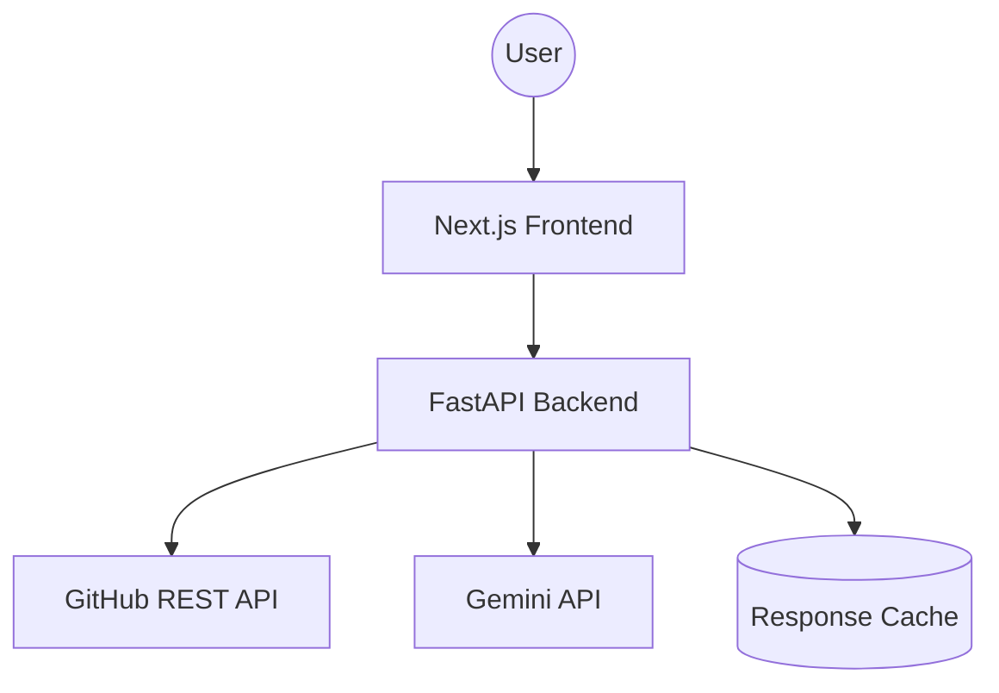

# GitHub Intelligence

Understand what a repository is really doing.

GitHub Intelligence turns a public GitHub repository into an engineering
intelligence dashboard: health scoring, activity and collaboration
analytics, AI-generated insights, and repository comparison — in one place.

> **Status:** core product complete — repository analysis, health scoring,
> engineering metrics, AI insights, and comparison are all implemented and
> wired end to end. See [Roadmap](#roadmap) for what's left for a full
> production launch (PDF export, command palette, deployment).

## Architecture



- **Frontend** — Next.js (App Router) + TypeScript + Tailwind CSS, deployed
  to Vercel.
- **Backend** — FastAPI + Pydantic + httpx, deployable to any container host
  (Render, Railway, Fly.io, etc.). Owns all GitHub and Gemini API access —
  no third-party credentials ever reach the browser.
- **Data flow** — the frontend never talks to GitHub or Gemini directly; it
  only calls the backend, which normalizes external responses into
  application-specific schemas before returning them.

## Tech stack

| Layer    | Technology |
|----------|------------|
| Frontend | Next.js, TypeScript, Tailwind CSS, Radix primitives, Recharts, lucide-react |
| Backend  | Python, FastAPI, Pydantic, httpx |
| AI       | Google Gemini |
| Testing  | pytest, pytest-asyncio, respx |

## Project structure

```text
github-intelligence/
├── backend/
│   └── app/
│       ├── main.py            # FastAPI app, CORS, router wiring
│       ├── config.py          # Environment-driven settings
│       ├── api/                # Route handlers
│       ├── clients/            # External API clients (GitHub, Gemini)
│       ├── services/           # Business logic
│       ├── schemas/            # Pydantic request/response models
│       └── utils/              # Logging, helpers
│
└── frontend/
    ├── app/                    # Next.js App Router pages
    ├── components/
    │   ├── ui/                 # Base primitives (button, etc.)
    │   ├── landing/             # Landing page sections
    │   ├── repository/          # Dashboard sections (upcoming)
    │   ├── charts/               # Chart wrappers (upcoming)
    │   ├── ai/                   # AI chat/insights UI (upcoming)
    │   └── layout/               # Header, footer, status
    ├── lib/                    # API client, parsing/validation helpers
    ├── hooks/
    └── types/
```

## Local setup

### Prerequisites
- Node.js 20+
- Python 3.12+

### Backend

```bash
cd backend
python3 -m venv venv
source venv/bin/activate
pip install -r requirements.txt
cp .env.example .env   # fill in GITHUB_TOKEN / GEMINI_API_KEY when needed
uvicorn app.main:app --reload --port 8000
```

Health check: `curl http://localhost:8000/api/health`
API docs: http://localhost:8000/docs

### Frontend

```bash
cd frontend
npm install
cp .env.example .env.local
npm run dev
```

App: http://localhost:3000

### Docker (backend)

```bash
cd backend
docker build -t github-intelligence-api .
docker run --env-file .env -p 8000:8000 github-intelligence-api
```

## Environment variables

**backend/.env**

| Variable | Description |
|----------|-------------|
| `ENVIRONMENT` | `development` or `production` |
| `LOG_LEVEL` | Python logging level |
| `GITHUB_TOKEN` | Personal access token; raises GitHub's rate limit from 60/hr to 5000/hr. No special scopes needed for public repos. |
| `GEMINI_API_KEY` | Google Gemini API key, used for AI insights and "Ask this repository" |
| `FRONTEND_URL` | Frontend origin, used for CORS |
| `CACHE_TTL_SECONDS` | How long GitHub API responses are cached |

**frontend/.env.local**

| Variable | Description |
|----------|-------------|
| `NEXT_PUBLIC_API_URL` | URL of the FastAPI backend |

Secrets (`GITHUB_TOKEN`, `GEMINI_API_KEY`) live only in the backend
environment and are never sent to or read by the frontend.

## API

Currently implemented:

```text
GET  /api/health

GET  /api/repositories/{owner}/{repo}
GET  /api/repositories/{owner}/{repo}/languages
GET  /api/repositories/{owner}/{repo}/issues
GET  /api/repositories/{owner}/{repo}/pulls
GET  /api/repositories/{owner}/{repo}/contributors
GET  /api/repositories/{owner}/{repo}/releases
GET  /api/repositories/{owner}/{repo}/analytics      # health score + engineering metrics + activity
POST /api/repositories/{owner}/{repo}/ai/summary     # AI engineering review
POST /api/repositories/{owner}/{repo}/ai/ask         # "Ask this repository"
POST /api/compare                                     # side-by-side comparison
```

Full interactive documentation is auto-generated by FastAPI at `/docs`.

### Repository Health Score

A transparent, deterministic 0-100 score computed from six weighted
factors — activity, maintenance, issue health, pull request health,
release health, and community engagement — each traced back to real data
fetched for that repository. See `backend/app/services/analytics_service.py`
for the exact methodology; it's also surfaced in the UI via "How is this
calculated?" on the health score card.

### AI insights

The `ai/summary` and `ai/ask` endpoints call Google Gemini with a
structured JSON context built entirely from fetched GitHub data — the
model is instructed to reason over that data only, never to invent
repository facts. Requires `GEMINI_API_KEY`; without it, these endpoints
return a friendly 503 rather than failing silently.

### Caching

GitHub responses are cached in-memory (TTL from `CACHE_TTL_SECONDS`,
default 300s) at the client request layer, so repeated calls for the same
repository within the cache window don't re-hit GitHub's API. The
interface (`app/utils/cache.py`) is intentionally small so a Redis-backed
implementation can be swapped in later without touching callers.

## Testing

```bash
cd backend
pytest
```

Tests mock all external calls (GitHub, Gemini) — no real network calls are
made in the unit test suite.

## Security

- GitHub and Gemini credentials are read from environment variables and
  used only inside `backend/`; they are never included in any response
  sent to the frontend.
- CORS is restricted to the configured `FRONTEND_URL`.
- No secrets are ever written to logs.
- `.env` files are git-ignored; only `.env.example` files are committed.

## Frontend features

- **Dashboard** — tabbed repository view (Overview, Issues, Pull Requests,
  Contributors, Releases, AI Insights), each tab lazily fetched
- **Health score** — visual breakdown of all six factors with an
  expandable methodology explanation
- **Engineering metrics** — issue resolution rate, PR merge rate, release
  cadence, bus factor, clearly labeled as estimates
- **Language breakdown**, **activity timeline**, **contributor
  distribution** with bus-factor note
- **AI panel** — on-demand engineering review (summary/strengths/risks/
  recommendations) plus a free-form "Ask this repository" chat with quick
  question suggestions
- **Compare** — side-by-side health, stars, forks, issues, contributors,
  language, and license for any two repositories
- **Share & export** — copy a stable `/analyze/{owner}/{repo}` link, or
  export a Markdown engineering report generated from the currently loaded
  dashboard data
- **Recent repositories** — stored in `localStorage`, no backend/database
  needed for anonymous users
- Skeleton loaders and friendly error states (404 / rate-limit / network /
  AI-unavailable) throughout

## Roadmap

Core product is complete. Remaining work for a full production launch:

1. ~~Backend foundation~~ ✅
2. ~~Frontend foundation~~ ✅
3. ~~GitHub API client~~ ✅
4. ~~Repository endpoint + normalized schemas~~ ✅
5. ~~Repository dashboard (overview, health score, languages)~~ ✅
6. ~~Issues, pull requests, contributors, releases, activity timeline~~ ✅
7. ~~AI repository intelligence + "Ask this repository"~~ ✅
8. ~~Repository comparison~~ ✅
9. ~~Caching layer~~ ✅ (in-memory; Redis-ready interface)
10. ~~Shareable URLs, export (Markdown), recent-history~~ ✅
11. Production hardening — deeper accessibility pass, PDF export, command
    palette (Ctrl+K), keyboard shortcuts, Open Graph metadata, mobile
    layout polish beyond the current responsive baseline
12. Deployment — Vercel (frontend) + Render/Railway/Fly.io (backend)

## License

Not yet decided.
